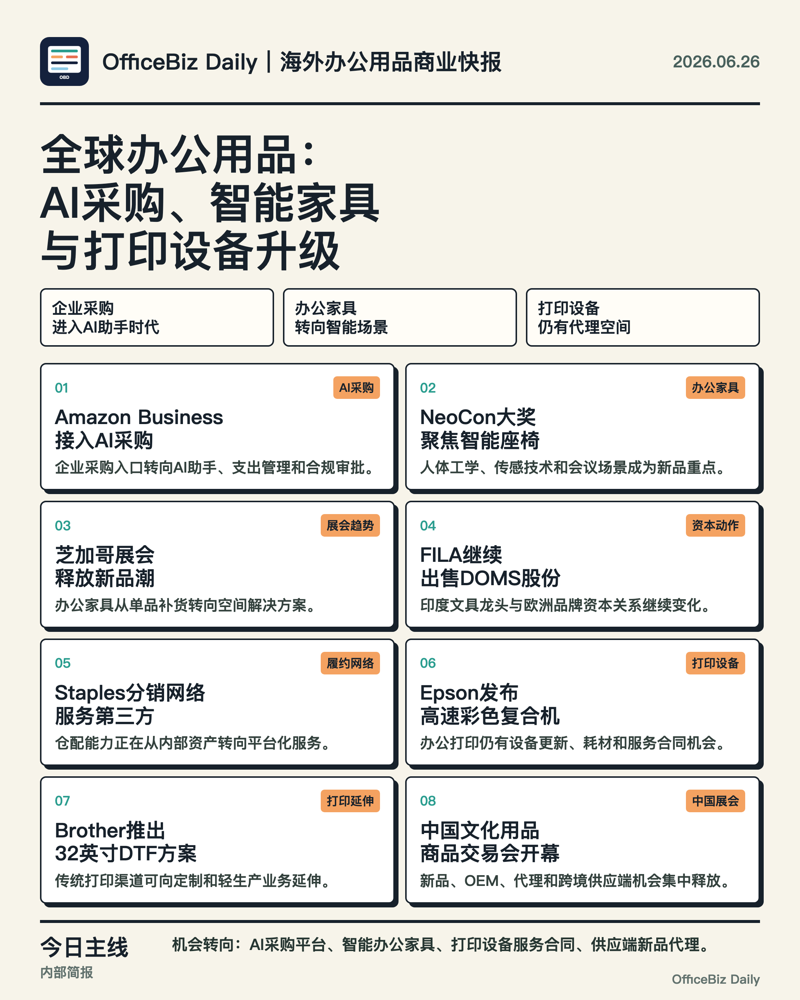
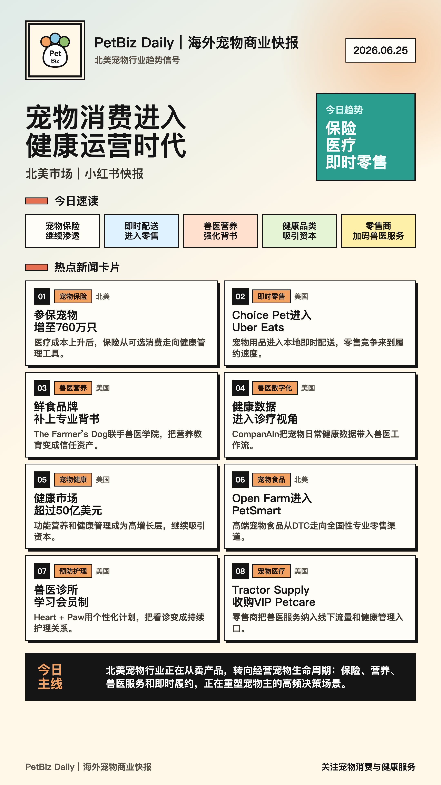
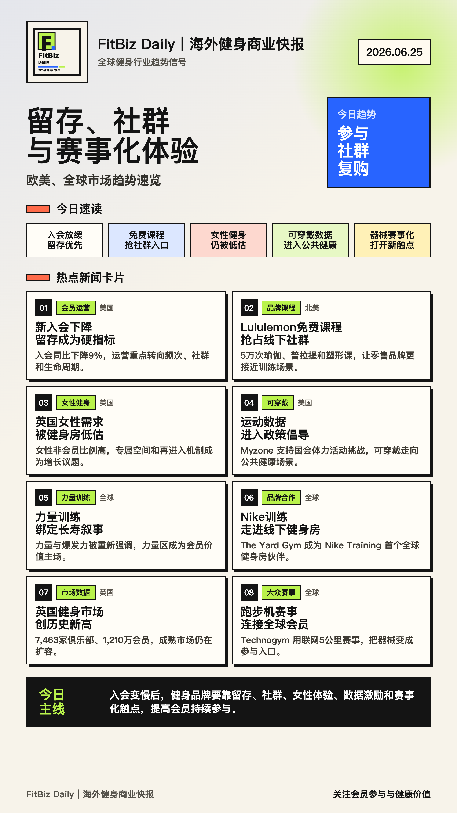

# Industry Brief Generator Skill

一个面向 Codex 的通用行业快报生成器 Skill。输入任意细分行业和目标市场，它会先生成可筛选的候选选题池，再根据用户选择生成行业快报、海报和渠道文案。

English edition: [industry-brief-generator-skill-en](https://github.com/vchenchen/industry-brief-generator-skill-en)

它把行业快报拆成两个阶段：先生成有来源链接的候选选题池，再由用户选择最终编号，最后生成文字版快报、海报和渠道文案。

## What It Does

- 输入行业、市场、关注重点、排除内容和最终用途
- 自动搜索海外行业新闻、展会、新品、并购、政策和趋势
- 先输出 20 条候选选题
- 用户选出 8 条后，再生成最终快报
- 支持内部简报、公众号、小红书、客户沟通等用途
- 信息不足时不硬编、不凑数、不伪造来源
- 海报生成后要求做视觉 QA，尤其检查中文断行和底部排版密度

## Why Candidate-First

行业快报最容易出问题的地方不是排版，而是选题质量。这个 Skill 把“收集候选”和“正式发布”拆开，避免模型直接替用户决定最终内容。

适合需要人工判断的场景：

- 市场情报日报
- 海外行业热点追踪
- 经销代理机会筛选
- 内部经营简报
- 小红书、公众号、客户沟通内容生产

## Demo

### 办公用品行业



### 宠物行业



### 健身行业



## Install

This repository uses the Codex repository-scope skill layout:

```text
.agents/skills/industry-brief-generator/
```

Clone this repository and start Codex from the repository root. Codex should detect the skill automatically.

You can also copy this folder into your own project:

```text
your-project/.agents/skills/industry-brief-generator/
```

If the skill does not appear, restart Codex.

## Quick Start

```text
使用 $industry-brief-generator，帮我生成一个行业快报候选池。

输入具体行业：办公用品行业
输入具体市场：全球
输入重点关注内容：行业热点新闻、展会、新产品、经销代理机会
输入排除内容：自媒体、企业软文
输入最终用途：公司内部简报
```

## Usage

Explicit invocation:

```text
Use $industry-brief-generator to create a candidate-first overseas industry brief.
```

Chinese prompt:

```text
使用 $industry-brief-generator，帮我生成一个行业快报候选池。
```

Recommended input format:

```text
输入具体行业：
输入具体市场（如：欧美/亚太/全球）：
输入重点关注内容：如行业并购、价格、供需、扩产、政策、展会、新品
输入排除内容：如泛财经、自媒体、企业软文
输入最终用途：如小红书/公众号/内部简报/客户沟通
```

Example:

```text
输入具体行业：办公用品行业
输入具体市场：全球
输入重点关注内容：行业热点新闻、展会、新产品、经销代理机会
输入排除内容：自媒体、企业软文
输入最终用途：公司内部简报
```

## Workflow

1. Read or create an industry config.
2. Search current sources and generate a candidate pool first.
3. Wait for the user to choose exactly 8 item numbers.
4. Generate the final brief and poster.
5. Visually inspect the poster before delivery.

The skill intentionally blocks final output until the user selects the final items.

## Included Example Configs

The skill includes sample YAML configs for:

- fitness
- chemical
- pet
- hotel
- commercial real estate
- office supplies

You can adapt these configs for any industry.

## Release Notes

See [CHANGELOG.md](CHANGELOG.md).

## Good For

- Market research teams
- Consulting teams
- Industry media operators
- Overseas business development
- Content teams
- Internal strategy briefings
- Export and distribution teams

## Trust Rules

The skill should not:

- fabricate sources, dates, companies, or links
- turn self-media posts into industry facts
- include weakly related financial news just to fill the list
- generate final posters before the user selects final items

If public information is insufficient, it should stop and ask for better sources, company names, narrower industry boundaries, or permission to use older background materials.

## Repository Structure

```text
.agents/skills/industry-brief-generator/
├── SKILL.md
├── agents/openai.yaml
├── references/
└── assets/configs/
```

## License

MIT
