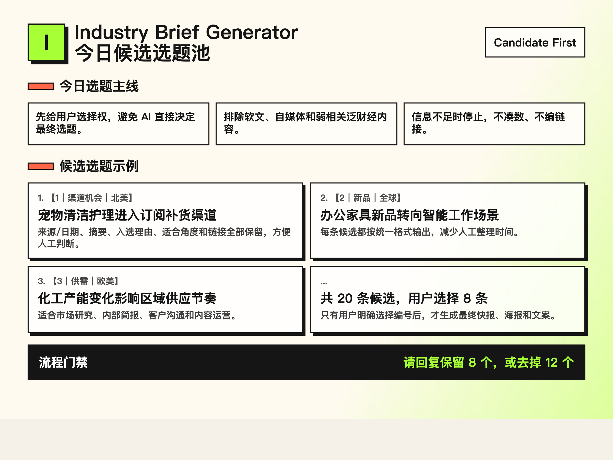

# Industry Brief Generator Skill

一个通用行业快报生成器。

输入行业、市场、关注重点、排除内容和最终用途。它先生成 20 条有来源的候选选题；用户选出 8 条后，再生成最终简报、海报和渠道文案。

English edition: [industry-brief-generator-skill-en](https://github.com/vchenchen/industry-brief-generator-skill-en)

## Solves This Pain

做行业快报最难的不是排版，而是每天找到靠谱选题。

这个 Skill 把流程拆成两步：

1. 先收集并筛选 20 条候选选题。
2. 用户选出 8 条后，再生成最终快报、海报和文案。

这样可以避免 AI 直接替你决定最终内容，也能减少软文、泛财经和弱相关信息混进快报。

## Demo

### 候选池预览



### 最终海报 Demo

| 宠物行业｜北美｜小红书快报 | 办公用品｜全球｜内部简报 | 健身行业｜海外市场｜商业快报 |
|---|---|---|
|  |  |  |

推荐再测试的 Demo 场景：

- 宠物行业｜北美｜小红书快报
- 办公用品｜全球｜内部简报
- 化工行业｜欧美｜价格、供需、扩产

## What It Does

- 输入行业、市场、关注重点、排除内容和最终用途
- 搜索海外行业新闻、展会、新品、并购、政策和趋势
- 先输出 20 条候选选题
- 用户选出 8 条后，再生成最终快报
- 支持内部简报、公众号、小红书、客户沟通等用途
- 生成海报后要求做视觉 QA，尤其检查中文断行和底部排版密度

## Trust-First Rules

这个 Skill 的核心卖点不是“多写一点”，而是“不硬编”。

它不会：

- 编造来源、日期、公司动作或链接
- 把自媒体内容包装成行业事实
- 用泛财经新闻凑数
- 在用户选择 8 条前生成最终快报

如果公开信息不足，它会停下来，请求更窄的行业边界、指定来源网站、公司名单，或允许使用较旧背景资料。

## Good For

- 咨询顾问
- 市场研究团队
- 出海企业
- 内容运营
- 行业媒体
- 销售和 BD 团队
- 经销代理和渠道拓展团队

## Install

This repository uses the Codex repository-scope skill layout:

```text
.agents/skills/industry-brief-generator-zh/
```

Clone this repository and start Codex from the repository root. Codex should detect the skill automatically.

You can also install it from GitHub:

```bash
python3 /Users/vchen/.codex/skills/.system/skill-installer/scripts/install-skill-from-github.py \
  --url https://github.com/vchenchen/industry-brief-generator-skill-zh/tree/main/.agents/skills/industry-brief-generator-zh
```

If the skill does not appear, restart Codex.

## Quick Start

```text
使用 $industry-brief-generator-zh。

输入具体行业：办公用品行业
输入具体市场：全球
输入重点关注内容：行业热点新闻、展会、新产品、经销代理机会
输入排除内容：自媒体、企业软文
输入最终用途：公司内部简报
```

## Input Format

```text
输入具体行业：
输入具体市场（如：欧美/亚太/全球）：
输入重点关注内容：如行业并购、价格、供需、扩产、政策、展会、新品
输入排除内容：如泛财经、自媒体、企业软文
输入最终用途：如小红书/公众号/内部简报/客户沟通
```

## Workflow

1. 读取或创建行业配置。
2. 搜索当前来源，先生成候选池。
3. 等待用户选择 8 个编号。
4. 生成最终文字快报、海报和渠道文案。
5. 实际查看海报，修复排版问题后再交付。

## Included Example Configs

- fitness
- chemical
- pet
- hotel
- commercial real estate
- office supplies

## Repository Structure

```text
.agents/skills/industry-brief-generator-zh/
├── SKILL.md
├── agents/openai.yaml
├── references/
└── assets/configs/
```

## License

MIT
